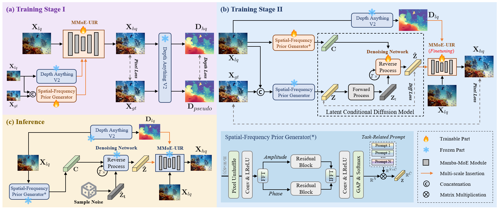

# :fire: UniUIR: Considering Underwater Image Restoration as an All-in-One Learner (TIP'2025)

> [[IEEE](https://ieeexplore.ieee.org/document/11202372)] &emsp; [[arxiv](https://arxiv.org/abs/2501.12981)] &emsp;[[Project Page](https://house-yuyu.github.io/UniUIR/)]


This is the official PyTorch codes for the paper:

>**UniUIR: Considering Underwater Image Restoration as an All-in-One Learner**<br>  [Xu Zhang<sup>1</sup>](https://house-yuyu.github.io/), [Huan Zhang<sup>2</sup>](https://scholar.google.com.hk/citations?user=bJjd_kMAAAAJ&hl=zh-CN), [Guoli Wang<sup>3</sup>](https://scholar.google.com.hk/citations?user=z-25fk0AAAAJ&hl=zh-CN), [Qian Zhang<sup>3</sup>](https://scholar.google.com.hk/citations?user=pCY-bikAAAAJ&hl=zh-CN), [Lefei Zhang<sup>1📧</sup>](https://scholar.google.com.hk/citations?user=BLKHwNwAAAAJ&hl=zh-CN), [Bo Du<sup>1</sup>](https://scholar.google.com.hk/citations?user=Shy1gnMAAAAJ&hl=zh-CN)<br>
> <sup>1</sup>Wuhan University, <sup>2</sup>Guangdong University of Technology, <sup>3</sup>Horizon Robotics<br>
> <sup>📧</sup>Corresponding author.




:star: If UniUIR is helpful to your images or projects, please help star this repo. Thank you! :point_left:


## :book: Citation

If you find our repo useful for your research, please consider citing our paper:

```bibtex
@ARTICLE{UniUIR,
  author={Zhang, Xu and Zhang, Huan and Wang, Guoli and Zhang, Qian and Zhang, Lefei and Du, Bo},
  journal={IEEE Transactions on Image Processing}, 
  title={UniUIR: Considering Underwater Image Restoration as an All-in-One Learner}, 
  year={2025},
  volume={34},
  number={},
  pages={6963-6977}}
```

## :postbox: Contact

If you have any questions, please feel free to reach us out at <a href="zhangx0802@whu.edu.cn">zhangx0802@whu.edu.cn</a>.


