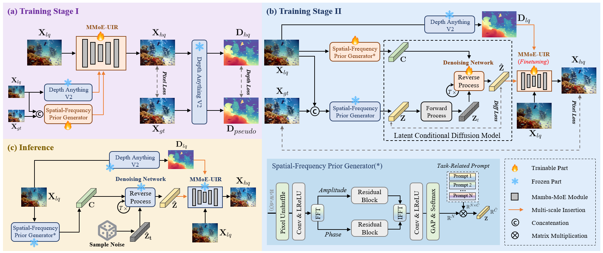

# :fire: UniUIR: Considering Underwater Image Restoration as an All-in-One Learner (TIP 2025)

> [[IEEE](https://ieeexplore.ieee.org/document/11202372)] [[arXiv](https://arxiv.org/abs/2501.12981)] [[Project Page](https://house-yuyu.github.io/UniUIR/)]

This is the official PyTorch implementation for our paper:

> **UniUIR: Considering Underwater Image Restoration as an All-in-One Learner**  
> [Xu Zhang<sup>1</sup>](https://house-yuyu.github.io/), [Huan Zhang<sup>2</sup>](https://scholar.google.com.hk/citations?user=bJjd_kMAAAAJ&hl=zh-CN), [Guoli Wang<sup>3</sup>](https://scholar.google.com.hk/citations?user=z-25fk0AAAAJ&hl=zh-CN), [Qian Zhang<sup>3</sup>](https://scholar.google.com.hk/citations?user=pCY-bikAAAAJ&hl=zh-CN), [Lefei Zhang<sup>1</sup>](https://scholar.google.com.hk/citations?user=BLKHwNwAAAAJ&hl=zh-CN), [Bo Du<sup>1</sup>](https://scholar.google.com.hk/citations?user=Shy1gnMAAAAJ&hl=zh-CN)  
> <sup>1</sup>Wuhan University, <sup>2</sup>Guangdong University of Technology, <sup>3</sup>Horizon Robotics



:star: If UniUIR is helpful to your research or projects, please consider starring this repository. Thank you!

## :sparkles: Highlights

- **All-in-one underwater image restoration.** UniUIR is designed for real-world underwater scenes with mixed degradations rather than a single isolated degradation type.
- **Mamba Mixture-of-Experts.** The model decouples degradation-specific issues while preserving global representation with linear complexity.
- **Spatial-frequency prior generator.** UniUIR extracts degradation priors in both spatial and frequency domains and adaptively selects task-specific prompts.
- **Depth-aware restoration.** Depth information from a large-scale pre-trained depth prediction model is introduced to handle region-dependent underwater degradation.

## :hammer_and_wrench: Environment

```bash
conda create -n uniuir python=3.10 -y
conda activate uniuir

# Install PyTorch according to your CUDA version from https://pytorch.org/
pip install torch torchvision torchaudio

# Common dependencies
pip install numpy pillow tqdm pandas opencv-python einops timm

# Metrics dependencies
pip install torchmetrics lpips
```


## Directory Structure

```text
UniUIR/
├── README.md
├── requirements.txt
├── __init__.py
├── train_stage1.py              # Stage I training, supports DDP
├── train_stage2.py              # Stage II training, supports DDP
├── inference.py                 # Folder inference for test images
├── datasets/
│   ├── __init__.py
│   └── uir_dataset.py           # Paired and unpaired image datasets
├── losses/
│   ├── __init__.py
│   └── losses.py                # Stage I/II losses and depth gradient loss
├── models/
│   ├── __init__.py
│   ├── uniuir.py                # Full UniUIR pipeline
│   ├── mmoe_uir.py              # MMoE-UIR backbone with SS2D + W-MoE
│   ├── sfpg.py                  # SFPG and SFPG*
│   ├── lcdm.py                  # Latent Conditional Diffusion Model
│   └── depth_extractor.py       # Depth Anything V2 HF wrapper and dummy fallback
├── utils/
│   ├── __init__.py
│   └── utils.py                 # PSNR, SSIM, LR schedule, checkpoint helpers
└── checkpoints/
    ├── stage1/
    │   ├── stage1.log
    │   ├── stage1_latest.pth
    │   └── stage1_best.pth
    └── stage2/
        ├── stage2.log
        ├── stage2_latest.pth
        └── stage2_best.pth
```

`checkpoints/` is generated during training. Python cache folders are omitted from the structure.

## Environment

Recommended environment:

```bash
conda create -n uniuir python=3.10 -y
conda activate uniuir

# Install PyTorch according to your CUDA version.
# Example for CUDA 12.1:
pip install torch==2.4.1+cu121 torchvision --extra-index-url https://download.pytorch.org/whl/cu121

pip install numpy pillow einops timm transformers>=4.40
pip install mamba-ssm causal-conv1d>=1.4.0
```

`mamba-ssm` and `causal-conv1d` must match your Python, PyTorch, CUDA, and CXX11 ABI. For your current `slurpp` environment we previously matched:

```text
Python 3.10
torch 2.4.1+cu121
causal_conv1d-*+cu12torch2.4cxx11abiFALSE-cp310-cp310-linux_x86_64.whl
```

Verify the Mamba dependency before training:

```bash
python -c "from mamba_ssm.ops.selective_scan_interface import selective_scan_fn; print('mamba ok')"
```

## Data Preparation

Paired training and validation datasets should use this layout:

```text
<data_root>/
├── input/
│   ├── 0001.png
│   └── ...
└── GT/
    ├── 0001.png
    └── ...
```

Important details:

- `input/` and `GT/` filenames must match.
- The GT folder is uppercase `GT`, matching `datasets/uir_dataset.py`.
- Training uses random `128x128` crops, so training images do not need fixed sizes.
- Validation images are resized to `256x256` in the training scripts.
- Inference images are not resized; they are reflect-padded to a multiple of 16 and cropped back to the original size after inference.

Default paths currently used by Stage I:

```text
/data2/users/zhangxu/ISP/6_UIR/Datasets/UIEB
/data2/users/zhangxu/ISP/6_UIR/Datasets/U90
```

## Training

The scripts support both single-GPU and DDP training. If running inside this directory:

```bash
cd /data2/users/zhangxu/ISP/6_UIR/UniUIR
```

use `-m train_stage1` and `-m train_stage2`. If running from the parent directory `/data2/users/zhangxu/ISP/6_UIR`, use `-m UniUIR.train_stage1` and `-m UniUIR.train_stage2`.

### Stage I

Stage I trains `MMoE-UIR + SFPG` with:

```text
L1(X_gt, X_hq) + lambda_depth * [L1(D_pseudo, D_hq) + lambda_grad * L_grad]
```

Two-GPU example on GPU 2 and 3:

```bash
cd /data2/users/zhangxu/ISP/6_UIR/UniUIR

CUDA_VISIBLE_DEVICES=2,3 torchrun --nproc_per_node=2 -m train_stage1 \
  --data_root /data2/users/zhangxu/ISP/6_UIR/Datasets/UIEB \
  --val_root /data2/users/zhangxu/ISP/6_UIR/Datasets/U90 \
  --out_dir ./checkpoints/stage1 \
  --debug_iters 0
```

Outputs:

```text
checkpoints/stage1/stage1.log
checkpoints/stage1/stage1_latest.pth
checkpoints/stage1/stage1_best.pth
```

`stage1_best.pth` is selected by validation PSNR.

### Stage II

Stage II loads Stage I weights, freezes `SFPG`, trains `LCDM + SFPG*`, and fine-tunes `MMoE-UIR`.

Two-GPU example:

```bash
cd /data2/users/zhangxu/ISP/6_UIR/UniUIR

CUDA_VISIBLE_DEVICES=2,3 torchrun --nproc_per_node=2 -m train_stage2 \
  --data_root /data2/users/zhangxu/ISP/6_UIR/Datasets/UIEB \
  --val_root /data2/users/zhangxu/ISP/6_UIR/Datasets/U90 \
  --stage1_ckpt ./checkpoints/stage1/stage1_best.pth \
  --out_dir ./checkpoints/stage2
```

Outputs:

```text
checkpoints/stage2/stage2.log
checkpoints/stage2/stage2_latest.pth
checkpoints/stage2/stage2_best.pth
```

`stage2_best.pth` is selected by validation PSNR.

## Inference

Run inference on a folder of underwater images:

```bash
cd /data2/users/zhangxu/ISP/6_UIR/UniUIR

python -m inference \
  --ckpt ./checkpoints/stage2/stage2_best.pth \
  --input /path/to/test_images \
  --out_dir ./results \
  --save_depth
```

For arbitrary input sizes, `UnpairedUIRDataset` pads images to a multiple of 16 and `inference.py` crops outputs back to the original height and width.


## Citation

```bibtex
@ARTICLE{UniUIR,
  author={Zhang, Xu and Zhang, Huan and Wang, Guoli and Zhang, Qian and Zhang, Lefei and Du, Bo},
  journal={IEEE Transactions on Image Processing},
  title={UniUIR: Considering Underwater Image Restoration as an All-in-One Learner},
  year={2025},
  volume={34},
  number={},
  pages={6963-6977}
}
```

## :postbox: Contact

If you have any questions, please feel free to contact us at zhangx0802@whu.edu.cn.
